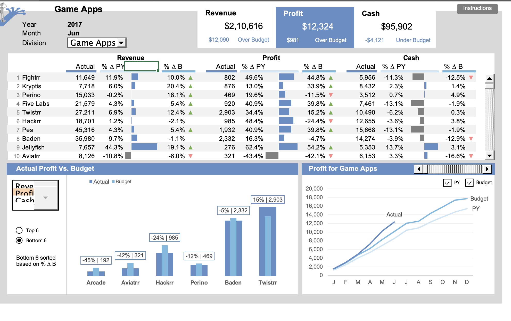

# Excel KPI Dashboard

This project showcases a fully interactive KPI dashboard built in Microsoft Excel. The dashboard visualizes key financial metrics such as revenue, profit, and cash flow across different time periods, allowing for trend analysis and business insights.

## 📁 File: `KPI_Dashboard.xlsx`

## 🔍 Features

- 📊 Actual vs Budget vs Previous Year (PY) comparison
- 📈 Monthly trend visualization
- 🧩 Interactive filters via slicers
- 🎯 Clean layout and wireframe planning
- 💡 No macros or VBA – 100% formula-driven

## 📂 Sheet Breakdown

### 1. Dashboard
- Contains interactive visualizations for:
  - Revenue
  - Profit
  - Cash Flow
- Displays comparisons across Actual, Budget, and PY values
- Focused on monthly trends for 2017

### 2. Data
- Backend data matrix used to power the dashboard
- Contains fields like `2017JunActualRevenue`, `2017JunBudgetProfit`, etc.

### 3. Calculation
- Houses all intermediate calculations

### 4. Wireframe
- Blueprint layout for dashboard design planning

### 5. Control
- Holds dropdowns/slicers used for filtering in the dashboard

## ✅ How to Use

1. Open the `KPI_Dashboard.xlsx` file in Microsoft Excel.
2. Navigate to the **Dashboard** tab.
3. Use slicers to interact and filter the visual KPIs.
4. Analyze trends and insights for decision-making.

## 👨‍💻 Author

**Fahim Ahmad**  
Data Analytics Enthusiast  
📅 Built as part of dashboard design and Excel KPI reporting practice
